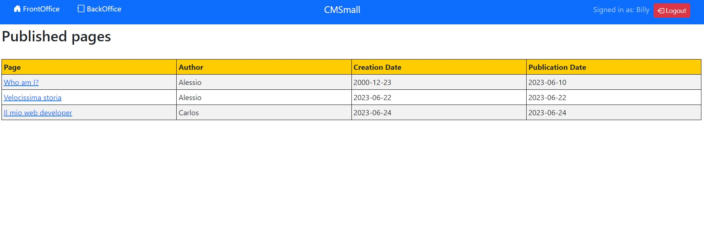
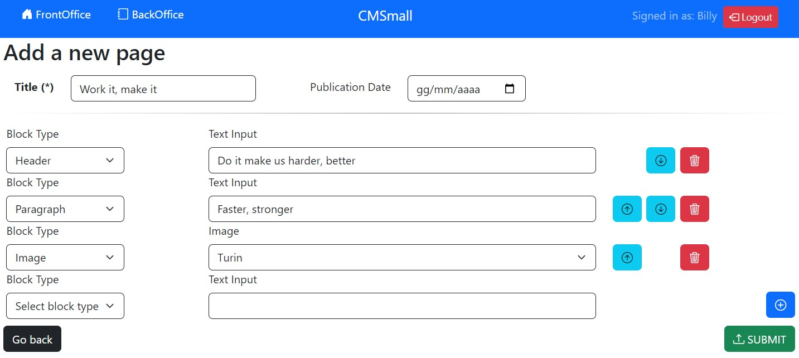

[](https://classroom.github.com/a/_XpznRuT)
# Exam #1: "CMSmall"

## Student: s309450 CAPPELLO ALESSIO 

# Server side

## API Server

- GET `/api/pages`
  - retrieve all the published pages
  - request parameters and request body content: ```none```
  - response body content:
  ```
  [
    {
      id: 1,
      title: 'Title1',
      creationdate: '2023-06-22',
      publicationdate: '2023-06-05',
      author: 'Alessio',
      idauthor: 1
    },
    {
      id: 2,
      title: 'Title2',
      creationdate: '2023-06-22',
      publicationdate: '2023-06-11',
      author: 'Alessio',
      idauthor: 1
    },
  ...
  ]
  ```

- GET `/api/pages/back`
  - retrieve all the pages
  - request parameters and request body content: ```none```
  - response body content:
  ```
  [
    {
      id: 1,
      title: 'Title1',
      creationdate: '2023-06-22',
      publicationdate: '2023-06-05',
      author: 'Alessio',
      idauthor: 1
    },
    {
      id: 2,
      title: 'Title2',
      creationdate: '2023-06-22',
      publicationdate: null,
      author: 'Alessio',
      idauthor: 1
    },
  ...
  ]
  ```

- GET `/api/page/:id`
  - retrieve page with id passed as parameter
  - request parameters: numeric id representing the page
  - request body content: ```none```
  - response body content:
  ```
  [
    {
      id: 1,
      type: 'H',
      content: 'myheader',
      position: 1,
      title: 'Title1'
    },
    {
      id: 2,
      type: 'I',
      content: 'Currents',
      position: 2,
      title: 'Title1'
    },
  ...
  ]
  ```

 - PUT `/api/page/:id`   
   - update the selected page
   - request body parameters: numeric id representing the page
   - request body content: the new page who will take place over the old one
   ```
    {
      page: {
      title: 'Title1',
      publicationdate: '2023-06-22',
      creationdate: '2023-06-21',
      idauthor: 1,
      blocks: [ [Object], [Object], [Object] ],
      id: '9'
      }
    }
   ```
   - response body content: id 
   ```
   9 
   ```

 - DELETE `/api/page/:id`
   - delete the selected page
   - request body parameters: numeric id representing the page
   - request body content: ```none```
   - response body content: a confirmation message ```Page deleted```

 - POST `/api/new`
   - create a new page
   - request body parameters: ```none```
   - request body content: an object representing the new page
   ```
   {
     page: {
     title: 'Add',
     publicationdate: '2023-06-22',
     idauthor: 1,
     blocks: [ [Object], [Object] ]
     }
   }
   ```   
   - response body content: the id assigned to the created page
   ```
   9 
   ```

 - GET `/api/title`
   - retrieve the website name
   - request body parameters and content: ```none```
   - response body content: an object containing the website name
   ```
   {title: 'CMSmall'}
   ```
  
 - PUT `/api/title`
   - update the website name
   - request body parameters: ```none```
   - request body content: an object containing the new website name
   ```
   {title: 'CMSig'}
   ```
   - response body content: a confirmation message ```Website name updated```

 - GET `/api/info/:id`
   - retrieve title and publication date of the selected page
   - request body parameters: page id
   - request body content: ```none```
   - response body content: an object containing title,publication date and creation date of the page
   ```
   { title: 'Title1', publicationdate: '2023-06-22', creationdate: '2023-06-21' }
   ``` 

 - GET `/api/author/:id`
   - retrieve information about a user/author
   - request body parameters: user id
   - request body content: ```none```
   - response body content: an object containing id an name of the user
   ```
   { id: 4, author: 'Diana' }
   ```

 - GET `/api/authors`
   - retrieve the whole list of users
   - request body parameters and body content: ```none```
   - response body content: an object containing all the ids and the names
   ```
    [
     { id: 1, name: 'Alessio' },
     { id: 2, name: 'Billy' },
     { id: 3, name: 'Carlos' },
     { id: 4, name: 'Diana' },
     { id: 5, name: 'Ernesto' }
    ]
   ```

 - POST `/api/sessions`
   - retrieve the user in the database if correctly authenticated
   - request body parameters: ```none```
   - request body content: an object containing username and password
   ```
   { username: 'a@gmail.com', password: 'pwd' }
   ```
   - response body content: an object describing the user
   ```
   { id: 1, username: 'a@gmail.com', name: 'Alessio', role: 1 }
   ```

 - GET `/api/sessions/current`
   - user code provided by passport session
   - request parameters and body content: ```none```
   - response body content: an object containing the user
   ```
   { id: 1, username: 'a@gmail.com', name: 'Alessio', role: 1 }
   ```

 - DELETE `/api/sessions/current`
   - user code provided by passport session 
   - request parameters and body content: ```none```
   - response body content: ```none```


## Database Tables

- Table `users` - contains id, name, email, salt, password, role
- Table `pages` - contains id, title, idauthor, creationdate, publicationdate
- Table `blocks` - contains id, idpage, type, content, position
- Table `website` - contains name

# Client side


## React Client Application Routes

- Route `/`: front office, both authenticated and not authenticated can see all the published pages.
- Route `/login`: login page, email and password required. After authentication, users will be redirected to the backoffice
- Route `/back`: back office, allowed only to authenticated. users. It displays all the pages (also programmed/drafts)
- Route `/new`: form to add a new page. It allows to define the blocks (type, content) and also to modify/reorder/delete them.
- Route `/page/:idPage`: the page with id `idPage` is displayed, with the page details (author, title, publication date) and its content.
- Route `/edit/:idPage`: the page author and the admins are allowed to edit the page with id `idPage`, so it's possible to change the blocks (type, content) and reorder/delete them. The admin is allowed to change also the author.
- Route `/website`: admin-only route, it allows to set the website name (displayed in the center of the navbar and also in the tab).
- Route `/error`: each invalid route is redirected to this screen, which allows to go back to the home page.
- Route `/*`: every route that differs from the ones listed above leads to the `/error` route.

## Main React Components

- `AddPage` (in `addPage.jsx`): component used to add a new page. It allows to select title, author if admin authenticated, publication date and the blocks. It contains the logic to manage the dynamic form.
- `LoginForm` (in `authComponent.jsx`): form where a user can do the login writing email and password. It shows the admin user and password by default to make the tests faster.
- `CmsNavbar` (in `cmsNavbar.jsx`): the website navbar. It is fixed to the top, it contains the buttons to switch from backoffice to frontoffice and viceversa. If an admin is authenticated, it displays also the website button to change the website name. It also contains the button to login/logout.
- `ConfirmationModal` (in `confirmationModal.jsx`): it displays a modal, it is used before deleting a page or to confirm the new website name. It can be dismissed by clicking on the x, on the cancel button or outside the modal area.
- `EditPage` (in `editPage.jsx`): component used to edit an existing page. It allows to change title, author if admin authenticated, publication date and the blocks. As the `AddPage` component, it contains the logic to add/delete blocks in the dynamic form.
- `FrontOffice` (in `pageLayout.jsx`): component which represents the published pages in a table, from which is possible to click the name (link) to display the page.
- `BackOffice` (in `pageLayout.jsx`): component which represents all the pages in a table. It's possible to show the page clicking on the name, but it's also possible to edit/delete a page (if authorized, or the buttons will be disabled).
- `PageDetail` (in `pageLayout.jsx`): component that displays the selected page attributes (title, author, publication date) and content.
- `RouteNotFound` (in `routeNotFound.jsx`): error component, it offers the link to go back to front office.
- `WebsiteName` (in `websiteName.jsx`): component that represents the form (textbox) to change the website name.

# Usage info

## Example Screenshot
### Front office


### Add a new page


## Users Credentials

|    email    | password |
|-------------|----------|
| a@gmail.com |   pwd    |
| b@gmail.com |   pwd    |
| c@gmail.com |   pwd    |
| d@gmail.com |   pwd    |
| e@gmail.com |   pwd    |

## Additional information

 - The mapping between author and email/username is given by the initial letter of the author
 - `Alessio` is the only admin of the website
 - `Carlos` is author of two pages
 - Both `Billy` and `Diana` are authors of one page
 - `Ernesto` has authored no pages
 - At the exam date there are 2 drafts, 4 published pages and 2 programmed pages
 - In the root there is a "backup" db file, in case it's necessary to revert to the original db